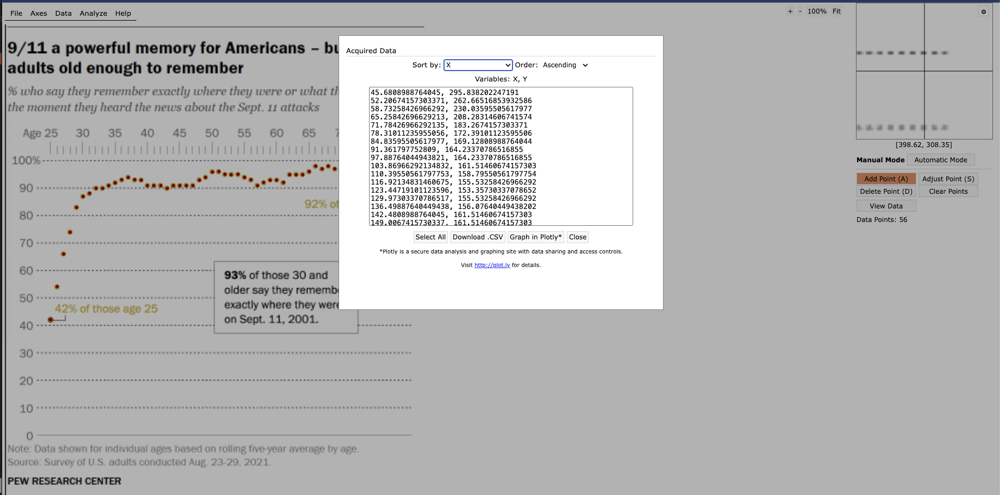

## *Prelude* {.text-justify}

**About the data/article in a nutshell:** This ambitious Pew Research piece examines the enduring legacy of 9/11 on American public opinion over two decades, tracking how the attacks created lasting collective memories for those old enough to remember when the unimaginable happened, briefly unified the nation in patriotic sentiment and trust in government, sparked initial support for military action that later waned, and reshaped views on terrorism, civil liberties, and Muslims in America. I chose 4 plots to display, as the article itself has a total of 11 plots. I think what guided my decision to choose only 4 is the uniqueness of the plots chosen. I also think each of one of the said plots conveyed a different message, whether related to the impact, chronology of said impact, or its impact on the political spectrum.  <br> If you like to give it a read (free), feel free to click [here](https://www.pewresearch.org/politics/2021/09/02/two-decades-later-the-enduring-legacy-of-9-11/).

**Overall Strategy for building first plot:** The data for first plot shows the % of people who remember where they were/what they were doing when they heard the the news. <br> Since there are many points plotted (\> 50), I took a snippet of the plot area and uploaded it to a free service/website I had not heard about before: [WebPlotDigitizer](https://web.eecs.utk.edu/~dcostine/personal/PowerDeviceLib/DigiTest/index.html)<br> I then used the manual option to 'add points' before viewing the data and copying and pasting it below; note that those are x and y coordinates. I finally normalized the data to get the actual values (or a very close approximation); that is age (X-axis) against percentage (Y-axis). <br>Below is the snippet of that last step. Since the relationship isn't linear, hence not able to use the rule of three/cross multiply, the values were generated after normalizing the coordinates in relation with both age and %. <br> Below is the snippet of the software generating said coordinates.



## **A Powerful Memory** {.text-justify}
Below I show the first 10 rows, with the first two columns showing the raw pull from WebPlotDigitizer while the next two show the normalized data; suitable to graph and match (as closely as possible) the article's.

```{r}
#| fig-width: 6
#| fig-height: 6
#| fig-dpi: 150
#| warning: false
#| message: false

library(tidyverse)
library(patchwork)
library(showtext)
library(janitor)
library(cowplot)
library(ggtext)
library(gt)
library(cowplot)

font_add(family = "franklin-medium", regular = "renv/library/macos/R-4.5/aarch64-apple-darwin20/sysfonts/fonts/Libre_Franklin/static/LibreFranklin-Medium.ttf") 

theme_set_custom <- function(base_size = 14) {
  
  # loading google fonts
  sysfonts::font_add_google("Libre Franklin", "franklin")
  sysfonts::font_add(
    family = "franklin-medium", 
    regular = "renv/library/macos/R-4.5/aarch64-apple-darwin20/sysfonts/fonts/Libre_Franklin/static/LibreFranklin-Medium.ttf"
  )
  showtext::showtext_auto()

  # applying ggplot2 theme
  ggplot2::theme_set(
    ggplot2::theme_minimal(base_family = "franklin", base_size = base_size) +
      ggplot2::theme(
        panel.background = ggplot2::element_rect(fill = "#f8f8f8", color = NA),
        plot.background = ggplot2::element_rect(fill = "#f8f8f8", color = NA)
      )
  )
}
theme_set_custom() # apply the theme built just above

gt_nyt_custom <- function(x, title = '', subtitle = '', first_10_rows_only = TRUE){
  
  x <- x |> clean_names(case = 'title')
  numeric_cols <- x |> select(where(is.double)) |> names()
  integer_cols <- x |> select(where(is.integer)) |> names()
  
  title_fmt <- if(title != "") glue::glue("**{title}**") else ""
  subtitle_fmt <- if(subtitle != "") glue::glue("*{subtitle}*") else ""
  
  x |>
    (\(x) if (first_10_rows_only) slice_head(x, n = 10) else x)() |>
    gt() |> 
    tab_header(
      title = md(title_fmt),
      subtitle = md(subtitle_fmt)
    ) |> 
    tab_style(
      style = list(
        cell_text(color = '#333333')
      ),
      locations = cells_body()
    ) |> 
    tab_style(
      style = list(
        cell_text(color = '#CC6600', weight = 'bold')
      ),
      locations = cells_column_labels(everything())
    ) |> 
    fmt_number(
      columns = c(numeric_cols),
      decimals = 1
    ) |> 
    fmt_number(
      columns = c(integer_cols),
      decimals = 0
    ) |> 
    tab_options(
      table.font.names = c("Merriweather", "Georgia", "serif"),
      table.font.size = 14,
      heading.title.font.size = 18,
      heading.subtitle.font.size = 14,
      column_labels.font.weight = "bold",
      column_labels.background.color = "#eeeeee",
      table.border.top.color = "#dddddd",
      table.border.bottom.color = "#dddddd",
      data_row.padding = px(6),
      row.striping.include_table_body = TRUE,
      row.striping.background_color = "#f9f9f9"
    )
  
}
# paste in data from WebPlotDigitizer
coords_data <- read.table(
  text = "45.6808988764045, 295.838202247191
  52.20674157303371, 262.66516853932586
  58.73258426966292, 230.03595505617977
  65.25842696629213, 208.28314606741574
  71.78426966292135, 183.2674157303371
  78.31011235955056, 172.39101123595506
  84.83595505617977, 169.12808988764044
  91.361797752809, 164.23370786516855
  97.88764044943821, 164.23370786516855
  103.86966292134832, 161.51460674157303
  110.39550561797753, 158.79550561797754
  116.92134831460675, 155.53258426966292
  123.44719101123596, 153.35730337078652
  129.97303370786517, 155.53258426966292
  136.49887640449438, 156.07640449438202
  142.4808988764045, 161.51460674157303
  149.0067415730337, 161.51460674157303
  156.07640449438202, 161.51460674157303
  162.60224719101123, 164.23370786516855
  168.58426966292134, 161.51460674157303
  175.11011235955056, 161.51460674157303
  181.63595505617977, 161.51460674157303
  188.16179775280898, 161.51460674157303
  194.6876404494382, 156.07640449438202
  200.6696629213483, 153.35730337078652
  207.73932584269664, 147.9191011235955
  214.26516853932586, 147.3752808988764
  220.24719101123597, 150.0943820224719
  226.22921348314608, 150.638202247191
  233.2988764044944, 150.0943820224719
  239.8247191011236, 153.35730337078652
  246.35056179775282, 155.53258426966292
  252.87640449438203, 161.51460674157303
  258.85842696629214, 158.25168539325844
  265.3842696629213, 156.07640449438202
  271.91011235955057, 156.07640449438202
  278.9797752808989, 158.25168539325844
  284.961797752809, 150.638202247191
  291.48764044943823, 150.638202247191
  298.0134831460674, 150.638202247191
  304.53932584269666, 147.3752808988764
  311.06516853932584, 141.9370786516854
  317.5910112359551, 144.6561797752809
  323.5730337078652, 141.9370786516854
  330.0988764044944, 144.6561797752809
  336.6247191011236, 144.6561797752809
  343.1505617977528, 144.6561797752809
  349.67640449438204, 150.638202247191
  356.2022471910112, 150.0943820224719
  362.72808988764046, 153.35730337078652
  368.7101123595506, 153.35730337078652
  375.7797752808989, 156.07640449438202
  381.761797752809, 152.81348314606743
  388.2876404494382, 156.07640449438202
  394.8134831460674, 150.638202247191
  401.3393258426966, 158.79550561797754", 
  sep = ",", 
  col.names = c("x", "y")
  )

# assign lower-upper bounds for both age and %
age_min <- 25   
age_max <- 80   
percent_min <- 42 
percent_max <- 99

# get lower-upper bounds for coordinates as well
x_pixel_min <- min(coords_data$x)
x_pixel_max <- max(coords_data$x)
y_pixel_min <- min(coords_data$y) 
y_pixel_max <- max(coords_data$y)

# normalize/transform coordinates to actual plot values/data
memory_data <- 
  coords_data |> 
  mutate(
    age = floor( age_min + (x - x_pixel_min) * (age_max - age_min) / (x_pixel_max - x_pixel_min) ),
    percentage = round( percent_max - (y - y_pixel_min) * (percent_max - percent_min) / (y_pixel_max - y_pixel_min), 1 )
  ) |> 
  arrange(age, desc(x)) |> 
  group_by(age) |> 
  mutate(
    age_adj = if_else(row_number() > 1, age + 1, age)
    ) |> 
  ungroup() 

# there are missing ages, distinct() alone or even coupled with row_number() do not suffice
# map which ages are missing from current range of values
missing_ages <- setdiff(25:80, memory_data|> pull(age_adj))

# apply mapping using lead values as helpers 
memory_data_cleaned <- 
  memory_data |> 
  arrange(desc(x)) |> 
  mutate(
    lagged_age_adj = case_when(
      age_adj == lead(age_adj, order_by = age) ~ 1,
      TRUE ~ 0
    ),
    age_adj = coalesce(age_adj + lagged_age_adj, age),
    age_adj_final = case_when(
      is.na(age_adj + lagged_age_adj) ~ 80,
      age_adj + lagged_age_adj == 42 & lagged_age_adj == 1 ~ 41,
      age_adj + lagged_age_adj == 54 & lagged_age_adj == 1 ~ 53,
      TRUE ~ age_adj + lagged_age_adj
    )
  ) |> 
  mutate(
    color_code = if_else(age_adj_final %in% c(25, 80), '#000000', '#D4AF37')
  ) |> 
  select(
    x, y, age = age_adj_final, percentage, color_code
    ) |> 
  arrange(age)

# check that all ages are mapped
# setdiff(25:80, memory_data_cleaned$age) ## all ages are mapped

memory_data_cleaned |> 
  gt_nyt_custom(title = 'First 10 Records post Normalization')

# work stats for first plot 
title <- '**9/11 a powerful memory for Americans – but only for <br> adults old enough to remember**'
subtitle <- '*% who say they remember exactly where they were or what they were doing <br> the moment they heard the news about the Sept. 11 attacks*'
caption <- c(
  'Note: Data shown for individual ages based on rolling five-year average by age.<br>
   Source: Survey of U.S. adults conducted Aug. 23-29, 2021.<br><br>
   <span style="color:black;"><b>PEW RESEARCH CENTER/K.Kardous</b></span>'
)

main_plot_label <- '**93%** of those 30 and <br> older say they remember <br> exactly where they were <br> on Sept.11, 2001.'
label_for_youngest <- '42% of those age 25'
label_for_oldest <- '92% of those ages 80+'

p1 <- memory_data_cleaned |>
  ggplot(aes(x = age, y = percentage, color = I(color_code))) + 
  geom_point(fill = '#D4AF37', shape = 21, size = 2) +
  coord_cartesian(ylim = c(0, 100), xlim = c(25, 81), clip = "off") +
  scale_x_continuous(
    breaks = c(25, 30, 35, 40, 45, 50, 55, 60, 65, 70, 75, 80),
    labels = c("", "", "", "", "", "", "", "", "", "", "", ""),  # we keep them blank and add a geom_text layer for added flexibility/customizability 
    minor_breaks = seq(25, 80, 1),
    sec.axis = dup_axis(), # this is neeed to create a duplicated x axis before moving it to the top of plot
    expand = c(0.03, 0.01) 
  )  +
  scale_y_continuous(
    breaks = seq(0, 100, 10), 
    expand = c(0, 0), 
    labels = c(as.character(seq(0, 90, 10)), ' ')
    ) +  
  labs(
    x = element_blank(),
    y = element_blank(),
    title = title,
    subtitle = subtitle,
    caption = caption
  ) + 
  geom_text(
  data = tibble(
    x = c(30, 35, 40, 45, 50, 55, 60, 65, 70, 75, 80),
    labels = c("30", "35", "40", "45", "50", "55", "60", "65", "70", "75", "80+")
  ),
  aes(x = x, y = 109, label = labels),
  inherit.aes = FALSE,
  color = "grey50",
  size = 3
  ) +
  geom_segment(
    data = tibble(x = seq(26, 79, 1)),  
    aes(x = x, xend = x, y = 105.5, yend = 103),  
    inherit.aes = FALSE,
    color = "grey50",
    linewidth = .2
  ) +
  geom_segment(
    data = tibble(
      x = c(25, 30, 35, 40, 45, 50, 55, 60, 65, 70, 75, 80)
      ),
    aes(x = x, xend = x, y = 107, yend = 103),  
    inherit.aes = FALSE,
    color = "grey50",
    linewidth = .2
  ) + 
  geom_label(
    x = 22, y = 100,
    label.size = NA,
    fill = "#f8f8f8",
    label = '100%',
    color = 'grey50'
  ) +
  geom_label(
    x = 23.4, y = 109,
    label.size = NA,
    fill = "#f8f8f8",
    label = '  Age 25',
    color = 'grey50',
    size = 3
  ) +
  # main plot label 
  geom_richtext(
    hjust = 0,
    x = 51, y = 50.5,
    label = main_plot_label,
    fill = "#f8f8f8",
    color = 'black',
    size = 4,
    label.r = unit(0, "pt"),
    label.padding = unit(c(0.5, 0.5, 0.5, 0.5), "lines")
  ) +
  # yongest age label 
  geom_text(
    x = 32.67, 
    y = 46,
    label = label_for_youngest,
    colour = '#D4AF37'
  ) +
  geom_segment(
    x = 26.5, xend = 26.5, 
    y = 43, yend = 41.4,
    linewidth = .2, 
    color = 'grey20'
    ) + 
  geom_segment(
    x = 26.5, xend = 25.3, 
    y = 41.5, yend = 41.5,
    linewidth = .2, 
    color = 'grey20'
    ) + 
  # oldest age label 
  geom_text(
    x = 73.3, 
    y = 84,
    label = label_for_oldest,
    colour = '#D4AF37'
  ) +
  geom_segment(
    x = 80, xend = 80, 
    y = 91.5, yend = 86,
    linewidth = .2, 
    color = 'grey20'
    ) +
  theme(
    plot.title.position = 'plot',
    plot.caption.position = 'plot',
    plot.caption = element_markdown(
      color = 'grey50', 
      size = 10.5,
      hjust = 0,
      lineheight = 1.2,
      margin = margin(t = 0, b = .1, unit = 'cm')
      ),
    plot.title = element_markdown(
      face = 'bold', 
      size = 16
      ),
    plot.subtitle = element_markdown(
      size = 12, 
      color = 'grey50', 
      lineheight = 1.25, 
      margin = margin(t = 0.3, b = .3, unit = 'cm')
      ),
    panel.grid.major.x = element_blank(),
    panel.grid.minor = element_blank(),
    # remove default axis elements
    axis.ticks.x.top = element_blank(),
    axis.ticks.x.bottom = element_blank(),
    axis.text.x.bottom = element_blank(),
    axis.line.x.top = element_blank(),
    axis.line.x.bottom = element_blank(),
    axis.text.y = element_text(color = "grey50"),
    # style the top labels
    axis.text.x.top = element_text(
      margin = margin(b = 0.4, unit = "cm"),
      color = "grey50",
      size = 9
      ),
    panel.grid.major = element_line(
      linetype = 2, colour = 'grey50', size = .2
      )
    )

```

The plot gets displayed below. Note that I added my name right after the source of the data (in the caption) only because while this is a replication from PEW Research Center, the data created doesn't *exactly* match the data used in the article, for the vast majority they do, and when they don't, they are within a  reasonable/low spread. <br> Crucially, the message conveyed in the plot stays the same: there is a generational 'spread' in impact on American collective memory regarding 9/11: 93% of those ages 30+ have a vivid memory of the moment they heard the news while *only* 42% of their 'age 25' counterparts share this experience.
42% is still surprisingly high in my opinion given that we are talking about an event that happened when that age group was 4-5 years old.
```{css}
#| echo: false
.bordered-plot {
  box-shadow: 
    0 -1px 0 0 rgba(0,0,0,0.6),  
    0 1px 0 0 rgba(0,0,0,0.6);  
  padding: 25px 0 0 0;
  margin: 10px 0;
  border: none;
}
```

```{r}
#| fig-cap: ""
#| class: "bordered-plot"
#| fig-width: 6
#| fig-height: 6
#| fig-dpi: 150
#| warning: false
#| message: false
#| echo: false
p1
```
Overall, I like the design of the plot. I especially appreciated moving the x axis to the top along with its 'ruler' like design as the vast majority of the data sits on the upper region of the plot. I also like the fact that they added a label 'aggregating' the % for those 30 and above, simultaneously giving the reader a better picture of the dynamic while also utilizing an otherwise 'dead' area in the plot.

## **A Devastating Legacy** {.text-justify}

The corollary of 9/11 was, among other things, an emotional toll on the vast majority of Americans, below we dive deeper into said toll.

```{r}
# build initial dataset, only 7 rows and 3 columns
media_coverage_data <- tibble(
  response = c(
    "Felt depressed",
    "Difficulty concentrating", 
    "Trouble sleeping",
    "Felt sad to watch",
    "Were frightened to watch",
    "Could not stop watching",
    "Tired out from watching"
    ),
  percentage = c(71, 49, 33, 92, 77, 63, 45)
  ) |> 
  mutate(
    category = c(
      rep("In a ***September 2001 survey*** immediately following the attacks, % who said they had ...", 3),
      rep("% who said, when watching media coverage, they ...", 4)
      ),
    category_code = c(rep('A', 3), rep('B', 4))
  )

# table display using {gt}
media_coverage_data |>
  select(
    response, percentage
    ) |>
  mutate(
    percentage = percentage / 100
  ) |> 
  gt_nyt_custom(
    title = 'American Sentiment at the Wake of 9/11'
  ) |> 
  fmt_percent(columns = Percentage, decimals = 0) |> 
  tab_options(table.width = px(350))

# keep annotation data consistent with original category names
annotation_data_top <- tibble(
  category = factor("In a ***September 2001 survey*** immediately following the attacks, % who said they had ...", 
                   levels = c("In a ***September 2001 survey*** immediately following the attacks, % who said they had ...",
                             "% who said, when watching media coverage, they ...")),
  x = 3.8,
  y = 10,
  label = "In a **September 2001 survey** immediately following the attacks, % who said they had ..."
)

annotation_data_bottom <- tibble(
  category = factor("% who said, when watching media coverage, they ...", 
                   levels = c("In a ***September 2001 survey*** immediately following the attacks, % who said they had ...",
                             "% who said, when watching media coverage, they ...")),
  x = 4.8,
  y = 10,
  label = "% who said, when watching media coverage, they ..."
)

title <- '**Days after 9/11, nearly all Americans said they felt sad; most felt depressed**'

caption <- c(
  'Source: Survey of U.S. adults conducted Sept. 13-17, 2021.<br><br>
   <span style="color:black;"><b>PEW RESEARCH CENTER</b></span>'
)

p2 <- media_coverage_data |> 
  mutate(
    category = factor(category, levels = c(
      "In a ***September 2001 survey*** immediately following the attacks, % who said they had ...",
      "% who said, when watching media coverage, they ..."
    ))
  ) |>
  ggplot(aes(x = reorder(response, percentage), y = percentage, group = category)) + 
  facet_wrap(~category, nrow = 2, ncol = 1, scales = 'free_y') +
  geom_col(fill = '#D4AF37') +
  geom_text(
    aes(label = percentage), 
    hjust = -0.5,
    size = 3,
    fontface = 'bold',
    color = "black"
    ) +
  geom_richtext(
    data = annotation_data_top,
    aes(x = x, y = y, label = label),
    hjust = .55,
    size = 3,
    color = "grey50",
    fontface = 'italic',
    fill = NA,
    label.color = NA,
    inherit.aes = FALSE
    ) +
  geom_text(
    data = annotation_data_bottom,
    aes(x = x, y = y, label = label),
    hjust = .92,
    size = 3,
    fontface = 'italic',
    color = "grey50",
    inherit.aes = FALSE
    ) +
  coord_flip(clip = 'off') + 
  labs(
    x = NULL, y = NULL,
    title = title,
    caption = caption
    ) +   
  theme(
    panel.grid.major = element_blank(),
    panel.grid.minor = element_blank(),
    axis.text.x = element_blank(),
    axis.text.y = element_text(face = 'bold'),
    strip.text = element_blank(),
    strip.placement = "outside",
    strip.background = element_blank(),
    panel.spacing.y = unit(0.8, "cm"),
    plot.title.position = "plot",   
    plot.caption.position = "plot", 
    plot.title = element_markdown(
      face = 'bold', 
      size = 10,      
      hjust = 0,
      margin = margin(b = .6, unit = 'cm')
      ),
    plot.caption = element_markdown(
      color = 'grey60', 
      size = 7,
      hjust = 0
   )
  )
```

```{css}
#| echo: false
.bordered-plot {
  box-shadow: 
    0 -1px 0 0 rgba(0,0,0,0.7),  
    0 1px 0 0 rgba(0,0,0,0.7);  
  padding: 25px 0 0 0;
  margin: 10px 0;
  border: none;
}
```

```{r}
#| fig-cap: ""
#| class: "bordered-plot"
#| fig-width: 6
#| fig-height: 6
#| fig-dpi: 150
#| warning: false
#| message: false
#| echo: false
p2
```
This is a typical and clear bar plot, the design effectively uses a clean horizontal bar chart structure that makes the data immediately readable. I like the decision to include the italic descriptive text above each section ("In a September 2001 survey..." and "% who said, when watching media coverage, they..."), because it provides essential context without cluttering the main visual elements. The faceted approach creates a clear separation between the two different survey questions while maintaining visual consistency.

## **....A Lasting One**
Even 15 years later, and even with many more recent events taking place (such as the Obama election), 9/11 remains the dominant historical event in American memory. In this 2016 survey, 76% of respondents named it among the most impactful events of their lifetime - nearly double the second-place Obama election at 40%.
```{r}
# set custom ggplot2 theme
# theme_set_custom(base_size = 20)

# set up titles, and other addenda to the plot
title <- "**In 2016 – 15 years after 9/11 – the attacks continued to be seen as one of the public's top historical events**"

subtitle <- "*In an open-ended question in 2016, % who named ___ as one of <br>the top 10 historic events that occurred in their lifetime that had the greatest impact on the country*"

caption <- c(
  '*Category includes mentions of the internet, computers, cellphones, smartphones and social media.<br>
   Note: Open-ended question<br>
   Source: Survey of U.S. adults conducted June 16-July 4, 2016.<br><br>
   <span style="color:black;"><b>PEW RESEARCH CENTER</b></span>'
)

data <- tibble(
  event = c('Sept. 11', 'Obama election', 'The tech revolution*', 'JFK assassination', 'Vietnam War'),
  historic_event = c(.76, .40, .22, .21, .20)
  ) |> 
  mutate(
    color_code = if_else(event == 'Sept. 11', '#D4AF37', '#E0C278')
  )

# display the data using {gt}
data |> 
  gt_nyt_custom(title = 'An Enduring Legacy (15 years after 9/11)') |> 
  fmt_percent(columns = `Historic Event`, decimals = 0) |> 
  cols_label(
    `Historic Event` = md("Consider a Historic<br>Event in Percent")
    ) |> 
   cols_align(
    align = "left",
    columns = `Historic Event`
  ) |> 
  tab_style(
    style = cell_text(
      align = "left",
      v_align = "middle" 
    ),
    locations = cells_column_labels(columns = c(Event, `Color Code`))
  )

# build p3; or plot 3
p3 <- data |> 
  ggplot(aes(x = fct_reorder(event, historic_event), y = historic_event, fill = I(color_code))) +
  geom_col() +
  coord_flip() +
  labs(
    x = element_blank(),
    y = element_blank(),
    title = title,
    subtitle = subtitle,
    caption = caption
  ) +
  geom_text(
    aes(label = historic_event * 100, y = historic_event / 2), 
    hjust = 0.5,
    size = 6,
    color = "black"
    ) +
  theme(
    plot.title.position = 'plot',
    plot.caption.position = 'plot',
    plot.caption = element_markdown(
      color = 'grey50', 
      size = 8.5,
      hjust = 0,
      lineheight = 1.2,
      margin = margin(t = 0, b = .1, unit = 'cm')
      ),
    plot.title = element_markdown(
      face = 'bold', 
      size = 11
      ),
    plot.subtitle = element_markdown(
      size = 8.5, 
      color = 'grey50', 
      lineheight = 1.25, 
      margin = margin(t = 0.3, b = .3, unit = 'cm')
      ),
    panel.grid.major = element_blank(),
    panel.grid.minor = element_blank(),
    axis.ticks.x.top = element_blank(),
    axis.ticks.x.bottom = element_blank(),
    axis.text.x.bottom = element_blank(),
    axis.line.x.top = element_blank(),
    axis.line.x.bottom = element_blank(),
    axis.text.y = element_text(face = 'bold'),
    axis.text.x.top = element_text(
      margin = margin(b = 0.4, unit = "cm"),
      color = "grey50",
      size = 9
      )
    )

```

```{css}
#| echo: false
.bordered-plot {
  box-shadow: 
    0 -1px 0 0 rgba(0,0,0,0.7),  
    0 1px 0 0 rgba(0,0,0,0.7);  
  padding: 25px 0 0 0;
  margin: 10px 0;
  border: none;
}
```

```{r}
#| fig-cap: ""
#| class: "bordered-plot"
#| fig-width: 8
#| fig-height: 6
#| fig-dpi: 150
#| warning: false
#| message: false
#| echo: false
p3
```
Overall, the design uses a clean horizontal bar format that makes the ranking immediately clear. The consistent color scheme keeps focus on the data hierarchy, while the dramatic bar length difference between 9/11 at 76% and other events effectively shows its dominance in American historical memory. <br> The end-positioned data labels create a scannable right-aligned column, and the minimal gridlines maintain focus on the comparative message without visual clutter.

## **Partisan Polarization on Islam Since 9/11**
```{r}
#| fig-width: 6
#| fig-height: 7
#| fig-dpi: 150
#| warning: false
#| message: false

title <- "**How views about whether Islam is more likely than other religions to encourage violence <br>became more partisan in the years after 9/11**"
subtitle <- "*% who say Islam is more likely than other religions to encourage violence among its believers*"

caption <- c(
  "Notes: Surveys for 2016-2021 data conducted online via Pew Research Center's American <br>Trends Panel (ATP). Trend shown for prior years conducted by telephone. ATP data is not <br> directly comparable to phone because of mode differences. For full question wording and <br> trend, see topline.<br>
   Source: Survey of U.S. adults conducted Aug. 23-29, 2021.<br><br>
   <span style='color:black;'><b>PEW RESEARCH CENTER</b></span>"
)
islam_views_data <- tribble(
  ~date, ~dem_lean_dem, ~total, ~rep_lean_rep,
  "Aug 2021", 32, 50, 72,
  "Sep 2019", 28, 48, 72,
  "Apr 2016", 34, 52, 75,
  "", 34, 52, 75,
  "Dec 2015", 30, 46, 67,
  "May 2013", 30, 42, 59,
  "Aug 2009", 32, 38, 49,
  "Aug 2007", 38, 45, 58,
  "Jul 2004", 42, 46, 56,
  "Mar 2002", 23, 25, 32
) |> 
  mutate(rn = row_number())

pivoted_islam_views_data <- islam_views_data |>
  pivot_longer(cols = -c(date, rn), names_to = "leanings", values_to = "percentage")

theme_set_custom()
color_palette <- c('dem_lean_dem' = '#375E78', 'total' = '#9C9C9C', 'rep_lean_rep' = '#bd2b24')

p4 <- pivoted_islam_views_data |> 
  ggplot(aes(x = percentage, y = fct_reorder(date, rn, .desc = TRUE), col = leanings)) +
  geom_point(size = 4) +
  scale_color_manual(values = color_palette) +
  geom_text(
    data = islam_views_data |> filter(rn != 10),
    aes(x = dem_lean_dem, y = date, label = if_else(rn == 1, paste0(dem_lean_dem, "%"), as.character(dem_lean_dem))),
    color = color_palette['dem_lean_dem'],
    size = 3,
    vjust = -1.2
  ) +
  geom_text(
    data = islam_views_data |> filter(rn == 10),
    aes(x = dem_lean_dem - 5, y = date, label = dem_lean_dem),
    color = color_palette['dem_lean_dem'],
    size = 3,
    vjust = -1.2
  ) +
  geom_text(
    data = islam_views_data,
    aes(x = total, y = date, label = if_else(rn == 1, paste0(total, "%"), as.character(total))),
    color = color_palette['total'],
    size = 3,
    vjust = -1.2
  ) +
  geom_text(
    data = islam_views_data,
    aes(x = rep_lean_rep, y = date, label = if_else(rn == 1, paste0(rep_lean_rep, "%"), as.character(rep_lean_rep))),
    color = color_palette['rep_lean_rep'],
    size = 3,
    vjust = -1.2
    ) +
  coord_cartesian(xlim = c(0, 120), clip = "off") +
  labs(
    x = element_blank(),
    y = element_blank(),
    title = title,
    subtitle = subtitle,
    caption = caption
    ) + 
  annotate(
    'text',
    x = c(27, 48, 75),
    y = 11.3,
    vjust = 2,
    size = 3,
    color = color_palette,
    label = c('Dem/Lean Dem', 'Total', 'Rep/Lean Rep')
    ) +
  # x axis line/scale
  annotate(
    'segment',
    x = -5, xend = 100,
    y = -.5, yend = -.5,
    color = 'grey60'
    ) +
  # 0 tick mark
    annotate(
    'segment',
    x = -5, xend = -5,
    y = -.5, yend = -.7,
    color = 'grey60'
    ) +
  # 0 tick label
  annotate(
    'text',
    x = -5, xend = -5,
    y = -.95, yend = -.95,
    label = '0',
    color = 'grey60'
    ) +
  # 50 tick mark
    annotate(
    'segment',
    x = 50, xend = 50,
    y = -.5, yend = -.7,
    color = 'grey60'
    ) +
  # 50 label
  annotate(
    'text',
    x = 50, xend = 50,
    y = -.95, yend = -.95,
    label = '50',
    color = 'grey60'
    ) +
  # 100 tick mark
  annotate(
    'segment',
    x = 100, xend = 100,
    y = -.5, yend = -.7,
    color = 'grey60'
    ) +
  # 100 label
  annotate(
    'text',
    x = 100, xend = 100,
    y = -.95, yend = -.95,
    label = '100',
    color = 'grey60'
    ) +
  geom_rect(
    xmin = -Inf, xmax = 123,
    ymin = 6.5, ymax = 7.5,
    fill = '#f8f8f8',
    inherit.aes = FALSE
    ) +
  theme(
    legend.position = 'none',
    plot.title.position = 'plot',
    plot.caption.position = 'plot',
    plot.caption = element_markdown(
      color = 'grey50', 
      size = 8.5,
      hjust = 0,
      lineheight = 1.2,
      margin = margin(t = 0.5, b = .1, unit = 'cm')
    ),
    plot.title = element_markdown(
      face = 'bold', 
      size = 11,
      lineheight = 1.2,
      margin = margin(t = 0, b = 0.6, unit = 'cm')
    ),
    plot.subtitle = element_markdown(
      size = 9.3, 
      color = 'grey50', 
      lineheight = 1.25, 
      margin = margin(b = .75, t = -.2, unit = 'cm')
    ),
    panel.grid.minor = element_blank(),
    axis.text.y = element_text(hjust = 1),
    axis.ticks.x.top = element_blank(),
    axis.ticks.x.bottom = element_blank(),
    axis.text.x.bottom = element_blank(),
    axis.line.x.top = element_blank(),
    axis.line.x.bottom = element_blank(),
    axis.text.x.top = element_text(
      margin = margin(b = 0.4, unit = "cm"),
      color = "grey50",
      size = 9
    ),
    panel.grid.major.x = element_blank(),
    panel.grid.major.y = element_line(
      linetype = 3, colour = 'grey50', size = .2
    ),
    plot.margin = margin(4, 0, 0, 0)
  ) +
  # add 'Telephone surveys' and gray line to go above it, we use grobs here as easiest to label things outside of plot area (and stretched over the panel area)
  annotation_custom(
    grob = grid::textGrob("Telephone surveys", gp = grid::gpar(fontsize = 10, col = "grey60", fontface = "italic")),
    xmin = -10, xmax = -15, 
    ymin = 6.9, ymax = 6.9
  ) +
  annotation_custom(
    grob = grid::linesGrob(gp = grid::gpar(col = "grey70", lwd = 1.5)),
    xmin = -27, xmax = Inf,
    ymin = 7.3, ymax = 7.3
    ) + 
  geom_rect(
    xmin = 104, xmax = Inf,
    ymin = -5, ymax = Inf,
    fill = '#f8f8f8',
    inherit.aes = FALSE
    ) 
  

```


```{css}
#| echo: false
.bordered-plot-custom {
  position: relative;
  padding: 25px 0 0 0;
  margin: 10px 0;
  border: none;
}

.bordered-plot-custom::before,
.bordered-plot-custom::after {
  content: "";
  position: absolute;
  left: 0;           
  width: 85%;          /* shorten line */
  height: 1px;
  background: rgba(0,0,0,0.7);
  z-index: 2;          /* make sure they sit above the plot */
  display: block;
}

.bordered-plot-custom::before {
  top: 0;
}

.bordered-plot-custom::after {
  bottom: 0;
}

```

```{r}
#| class: "bordered-plot-custom"
#| fig-width: 8
#| fig-height: 7
#| fig-dpi: 150
#| warning: false
#| message: false
#| echo: false
p4
```
::: {style="text-align: justify;"}
Above plot was probably the hardest one to replicate as many elements make up said plot.

The technical approach required several strategic decisions to achieve accurate replication. Rather than using `facet_wrap()` to separate the online and telephone survey periods, the solution avoided faceting entirely to maintain unified control over plot elements. This allowed for global styling changes and consistent spacing across the entire visualization.

One albeit 'hacky' way was to insert a dummy record with empty string as the date value ("") which was positioned strategically between the online and telephone survey sections. This created the necessary visual break without disrupting the data structure or requiring complex faceting logic that would complicate element positioning.

The dummy record approach enabled using `geom_rect()` to create a white rectangle that effectively "erases" the unwanted dummy row from view `(ymin = 6.5, ymax = 7.5)`. This rectangle spans the full plot width, creating a clean canvas for overlaying the divider elements.

The "Telephone surveys" label and horizontal line required annotation_custom() with grid grobs rather than standard ggplot annotations, since these elements needed to extend beyond the plot panel boundaries. The `grid::textGrob()` and `grid::linesGrob()` functions provided the necessary control for precise positioning outside the 'normal' coordinate system.

Additional complexity came from manually creating the bottom axis scale using multiple `annotate()` calls for tick marks and labels at 0, 50, and 100, since the standard axis was removed to achieve the clean aesthetic. The `coord_cartesian(clip = "off")` setting allowed these elements to render outside the typical plot boundaries.

Overall, I think the result demonstrates how complex professional visualizations often require combining multiple `ggplot` layers with custom grid graphics to achieve publication-quality results that match established design standards.<br> Thank you for taking the time to read this and more to come !
:::


